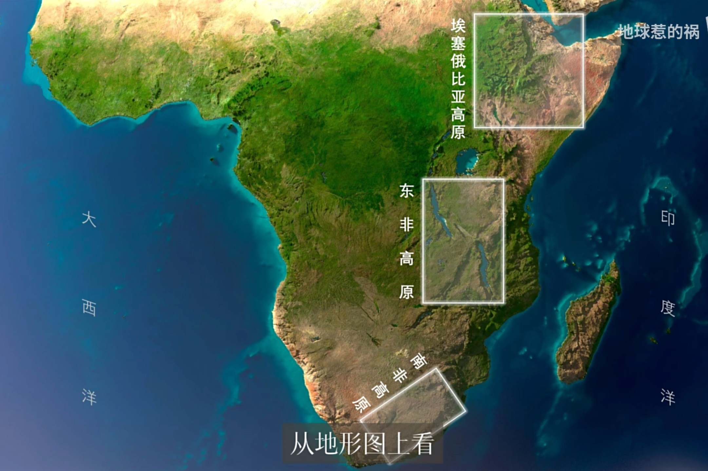
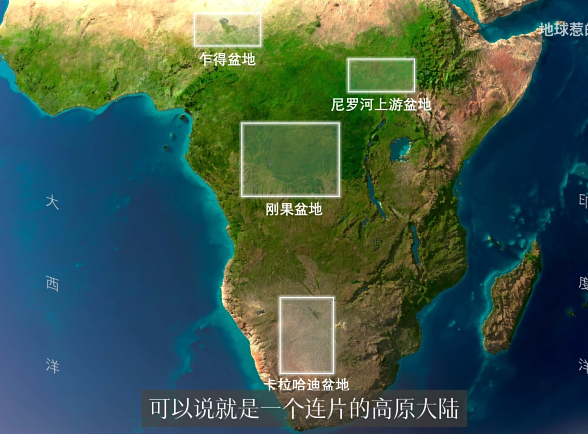
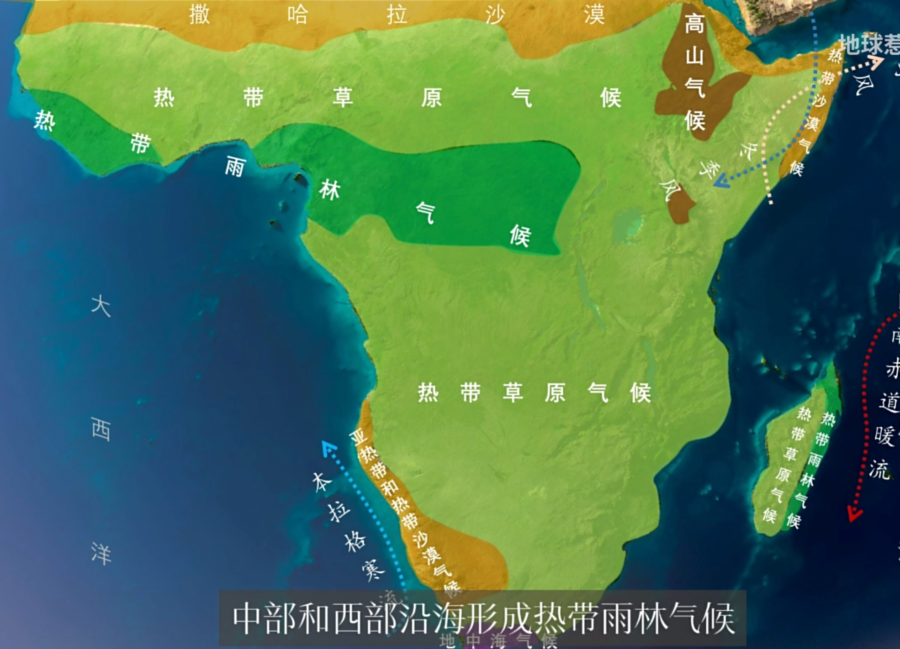

### 从类人猿到人类   

> 人类从类人猿到人类进化的时间维度的进化论学说   

* 地球形成于50亿年前   

* 40亿年前地球第一次形成了生物————单细胞生物。     

* 生物不断进化，从单细胞生物进化为原始植物，例如海藻。继而又进化为无脊椎生物，例如水母、蠕虫。   

* 大约3亿年前，某些无脊椎动物爬上陆地，形成最早的两栖动物。随后是大批爬行动物，接着是鸟类，最后又演化为哺乳动物。   
开启了哺乳类动物对于地球的统治地位的6000万年时光。    

名词解读-------------------------------------------------------------------------------------------------------------------------------------------------    

* 单细胞生物  

原子的结合形成分析，分子组合成有机化程度不同的聚合体，其中一些形成了生物。  

* 无脊椎生物      

动物按形态来分可分为两种:脊椎动物和无脊椎动物｡从名字可以看出来,脊椎动物和无脊椎动物之间的主要区别在于脊椎动物有脊椎或脊柱,而无脊椎动物没有｡   
无脊椎动物一般身体柔软,没有坚硬的能附著肌肉的内骨骼,但其实是有坚硬的外骨骼的(如大部分软体动物､甲壳动物及昆虫,通常称为“壳”),用以附著肌肉及保护身体｡    
所以说无脊椎动物是指没有脊椎骨,而不是指没有骨头｡     

* 哺乳类动物   

现存哺乳动物分为三大类群：  
单孔类，又称原兽类，代表是鸭嘴兽和针鼹。特征是卵生，而且卵，粪，尿从同一个孔（泄殖孔）排出。没有乳头，孵化的幼体直接舔吸母亲腹部皮肤分泌的乳汁。   
有袋类，又称后兽类，代表是澳洲的各种袋鼠袋熊袋貂袋獾，还有美洲的负鼠。特征是雌性没有完善的胎盘，发育不全的幼体在特殊的育儿袋中吸食乳汁发育长大。   
有胎盘类，又称真兽类，包括初单孔类和有袋类之外的其他所有哺乳动物，现代哺乳动物的绝对主流，天上飞的地下跑的水里游的草科里蹦的都有。      

哺乳动物的牙齿有明显的分化：门齿，犬齿，臼齿形态和功能完全不同。作为对比的恐龙嘴里的牙齿形态都差不多。   

> 人类起源之地 —— 撒南非洲，地理         

   
   

撒南指撒哈拉沙漠以南。非洲也被称为高原大陆，其高原广泛分布。地势较高这集中于非洲东岸，而中部盆地也是高原的一部分。可以说，非洲就是一个连片的高原。    
实际上，除了少数高原山峰外，大部分地区海拔并不高，因此非洲常夏而无冬。       

       
撒南非洲降水量呈由南向北递减，西南受寒流影响呈热带沙漠气候，东北部收离岸信风影响，降水量小，蒸发量却巨大 呈不典型的热带沙漠气候。   
除最南端及小地区维度较高形成地中海气候，其广大地区域均位于干湿分离的热带草原气候。    

 

> 人类起源之地 —— 撒南非洲，热带雨林气候的文明诅咒     

*农耕文明贡献了人类文明的绝大部分的生产力，非洲的地缘绝不适合发展农耕文明。*   

* 先天作物不足，无可被驯化的作物      
 
地球上能够储存作为食物的谷物的植物大多是富含淀粉、蛋白质、油脂的植物。植物之所以把精华聚集于种子其本质是因为在温带地区，植物无法过冬，霜冻之前，植物需要把营养聚集起来结成种子供给后代以养分。  固有立秋之后百草结籽，秋高而马肥。马只有在秋季才能吃到结籽的草本植物。   
热带地区的植物没有结籽的习惯，全球56种主要农作物也全部来自于温带。    

* 先天动物不足，无可被驯化的动物    

温带地区的群居动物在冬季掉队就意味着死亡，动物会听从头领指挥，因此性格温顺，控制头领可以控制整个族群。 热带动物脾气火爆，即使群居也会容易因为配偶、领地、头领位置大打出手，至今非洲的动物也鲜有被驯化的案例。    

* 现代非洲的农业地缘缺陷   

非洲肥沃的土壤并不多。   
事实上，所有的非沉积型土壤都不肥沃，中国南方的红壤、澳洲的荒漠、非洲的高原 其成因都是如此————雨水的淋溶作用下带走了土壤中的水溶性矿质离子，留下酸性的氧化矿物质。     
只有沉积性的土壤才足够肥沃，如风沙沉积的黄土高原、尼罗河，黄河，印度河形成的冲积平原、天山，昆仑山脚的绿洲.......    
非洲肥沃的地带足够的少，尼日河中上游流经的半干旱地带、火山眷顾的埃塞俄比亚熔岩高原这些地方也是古代非洲的文明起源。其他的地区只能做狩猎采集。     

因此，非洲非常需要农业水利改造，土壤改造，但这不是非洲农业端仅有的缺陷。   

在温带地区，夏季日照时间长，植物夜间呼吸作用时间短，利于积累有机物，热带地区几乎昼夜等长，不利于提升产量。而在中国，一年两季的南方产量也不会比一年一季的东北更高。   
热带，微生物活跃，快速分解，土壤肥力快速消耗。因此一片土地种一年休耕多年，形成了特有的游牧农业。而中国的商朝七次迁都的本质也是土壤肥力的下降，不过商的华北平原更为肥沃，种植数年才出现肥力下降。    

非洲常夏无冬，无寒冬灭杀虫卵与病菌，因此病虫常年肆虐无休，雪上加霜。   

因此，没有稳定的农业就会缺少有组织的国家，缺少阶级，这是非洲人散漫天性的本质成因，地缘下的枷锁，落后的合情合理。   

